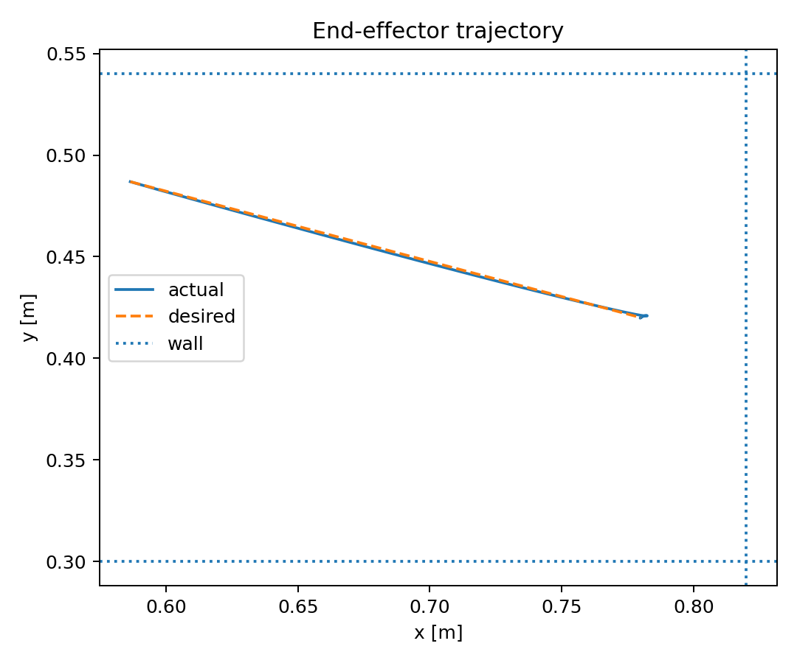
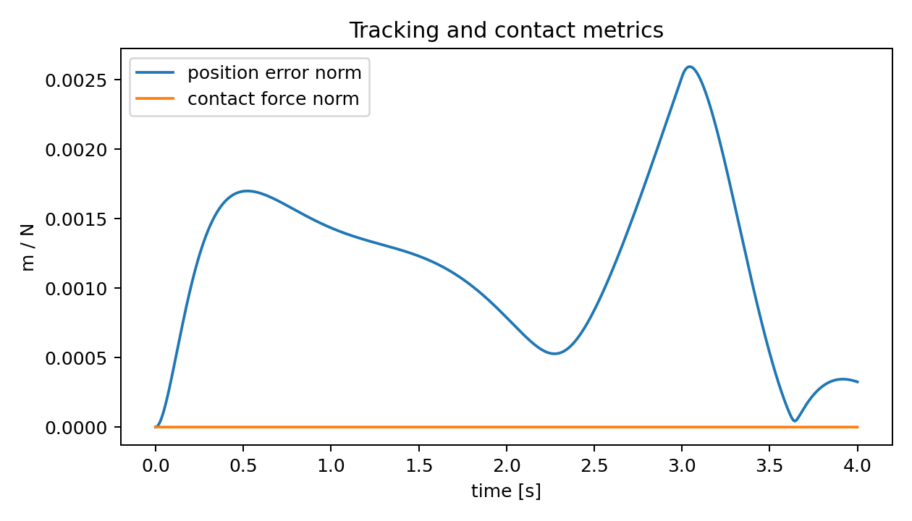
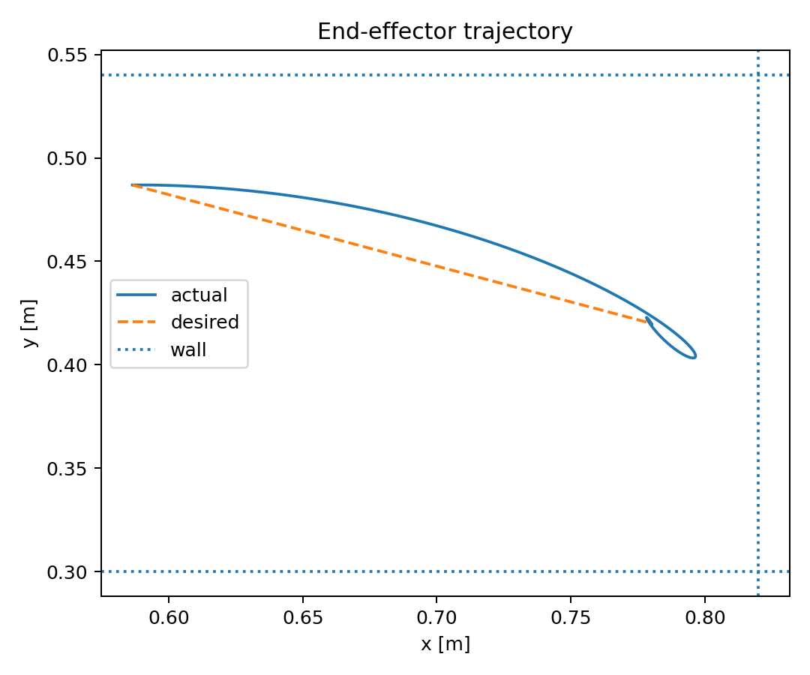
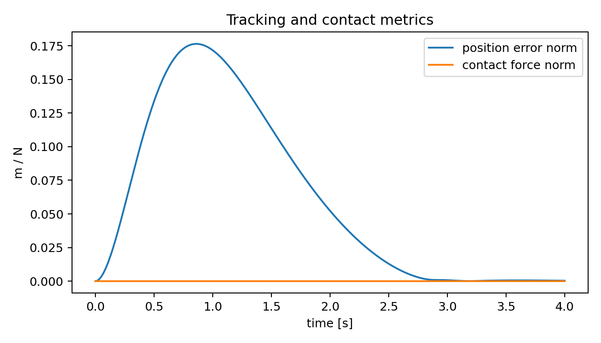

# SpaceR Manipulation Benchmark

A compact, GitHub-ready research prototype for **constrained robotic manipulation in a space-inspired setting**.

This project implements and benchmarks two controllers on a 2-DoF planar manipulator performing a **constrained approach / capture task** inspired by robotic interaction with fragile spacecraft panels, servicing fixtures, or docking interfaces.

The goal is to provide a technically credible portfolio project that demonstrates:
- forward/inverse kinematics,
- manipulator Jacobian-based control,
- Cartesian impedance control,
- task-space benchmarking,
- reproducible simulation results,
- research-style technical documentation.

## Project motivation

Space robotic manipulation often requires motion inside narrow workspaces, low-impact interaction near sensitive hardware, and robust task execution under geometric constraints. This repository is a **minimal but relevant manipulation benchmark** that showcases those ideas in a lightweight, reproducible way.

It is not presented as a full orbital robotics stack. Instead, it is a **focused control and evaluation prototype** suitable for a GitHub portfolio, internship/postdoc applications, or as a starting point for more advanced manipulation research.

## Implemented task

The simulated task is a **constrained end-effector approach**:
- the manipulator starts inside a bounded corridor,
- it tracks a smooth reference trajectory toward a target capture point,
- virtual walls define a narrow safe interaction region,
- a compliant contact model penalizes collisions with the corridor boundaries.

This setup is relevant to:
- docking / berthing alignment,
- panel or connector approach,
- tool insertion under geometric constraints,
- manipulation close to delicate structures.

## Controllers included

### 1. Cartesian impedance controller
A Jacobian-transpose controller produces joint torques from a Cartesian spring-damper law:

\[
\tau = J(q)^T\left(K_p(x_d-x) + K_d(\dot{x}_d-\dot{x})\right)
\]

This controller is the main research-relevant baseline for constrained interaction.

### 2. Joint-space PD controller
A simpler joint-space baseline tracks a fixed inverse-kinematics goal. It is included as a comparison point to show why task-space control is more appropriate for constrained manipulation.

## Repository structure

```text
spaceR_manip_project/
├── README.md
├── TECHNICAL_NOTE.md
├── requirements.txt
├── scripts/
│   └── run_benchmark.py
├── src/
│   └── spacer_manip/
│       ├── __init__.py
│       ├── controllers.py
│       ├── dynamics.py
│       ├── metrics.py
│       ├── tasks.py
│       └── visualize.py
└── results/
    ├── impedance_run.npz
    ├── impedance_timeseries.png
    ├── impedance_trajectory.png
    ├── joint_pd_run.npz
    ├── joint_pd_timeseries.png
    ├── joint_pd_trajectory.png
    ├── metrics.json
    └── metrics_table.md
```

## How to run

```bash
python -m venv .venv
source .venv/bin/activate
pip install -r requirements.txt
python scripts/run_benchmark.py
```

The script regenerates all plots and benchmark metrics in `results/`.

## Benchmark results

The following results were generated with the repository code included here.

| Controller | RMS pos. error [m] | Final error [m] | Peak contact [N] | Settling [s] | Constraint violations |
|---|---:|---:|---:|---:|---:|
| impedance | 0.0013 | 0.0003 | 0.00 | 0.50 | 0 |
| joint_pd | 0.0884 | 0.0003 | 0.00 | 2.38 | 0 |

## Interpretation

The impedance controller achieves:
- much lower trajectory tracking error,
- significantly faster settling,
- safe motion inside the corridor,
- a control structure that is directly relevant to constrained manipulation.

The joint PD controller eventually reaches the target, but it tracks the task much less accurately during the transient phase because it does not explicitly regulate end-effector behavior in task space.

## Generated figures

### Impedance controller trajectory


### Impedance controller tracking/contact


### Joint-PD trajectory


### Joint-PD tracking/contact


## Why this is useful on GitHub

This project is suitable for a robotics/manipulation portfolio because it shows that you can:
- formulate a relevant manipulation problem,
- implement kinematics and dynamics cleanly,
- compare controllers with meaningful metrics,
- document assumptions and limitations honestly,
- structure a technical repo like a small research artifact.

## Limitations

This repository is intentionally lightweight. It does **not** yet include:
- 6-DoF rigid-body dynamics,
- floating-base spacecraft dynamics,
- full contact mechanics,
- tactile sensing,
- vision feedback,
- reinforcement learning,
- ROS / Gazebo / Isaac integration.

That said, it is designed so those pieces can be added progressively.

## Suggested extensions

Strong next steps for making the project even more aligned with space robotics research:
1. Add obstacle-aware trajectory generation.
2. Replace the planar arm with a 6-DoF manipulator model.
3. Introduce sensor noise and state estimation.
4. Add a force-limited insertion phase.
5. Implement model predictive control.
6. Export the benchmark to ROS 2 + Gazebo or Isaac Sim.
7. Add vision-based target localization.
8. Evaluate robustness under parameter uncertainty.

## Citation / portfolio note

If you place this on GitHub, present it as:

> A compact research prototype for constrained robotic manipulation in a space-inspired scenario, comparing Cartesian impedance control against a joint-space baseline on a narrow-corridor approach task.

That framing is accurate, professional, and aligned with the type of work described in the SpaceR posting.
